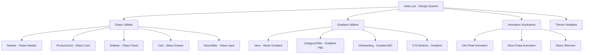

# Market Sur — Glassmorphism + Gradient UI Redesign Plan

## Design Direction

**Apple/iOS-inspired Glassmorphism** with vibrant gradient accents, frosted glass effects, and a premium feel. The blue brand identity (#1877F2) is preserved but elevated with depth, blur, and multi-color gradient touches.

---

## Design System Changes

### Color Palette

| Token                  | Light                        | Dark                     | Usage                                |
| ---------------------- | ---------------------------- | ------------------------ | ------------------------------------ |
| `--color-primary`      | `#2563EB`                    | `#3B82F6`                | Primary brand (slightly richer blue) |
| `--color-accent-start` | `#6366F1`                    | `#818CF8`                | Gradient start (indigo)              |
| `--color-accent-end`   | `#2563EB`                    | `#3B82F6`                | Gradient end (blue)                  |
| `--color-glass-bg`     | `rgba(255,255,255,0.6)`      | `rgba(30,30,40,0.6)`     | Glass card background                |
| `--color-glass-border` | `rgba(255,255,255,0.3)`      | `rgba(255,255,255,0.08)` | Glass border                         |
| Body BG light          | `#F0F4FF` (soft blue-tinted) | —                        | Subtle blue tint                     |
| Body BG dark           | `#0F0F1A` (deep navy-black)  | —                        | Rich dark background                 |

### Glass Utility Classes

```css
.glass-card — backdrop-blur-xl, semi-transparent bg, subtle border, soft shadow
.glass-header — sticky frosted header with blur
.glass-input — frosted input field
.glass-button — frosted button with gradient hover
.gradient-text — gradient text fill for headings
.gradient-border — animated gradient border effect
```

### Typography

- Keep **Plus Jakarta Sans** as primary
- Add gradient text treatment for key headings
- Slightly increase letter-spacing on section titles

### Animations

- Glass shimmer on skeleton loaders
- Gradient shift on hero backgrounds (already exists, enhance)
- Subtle float animation for decorative orbs
- Glow pulse on focused inputs
- Card entrance with glass reveal effect

---

## Component-by-Component Changes

### 1. `index.css` — Design System Foundation

- Update theme variables with new palette
- Add glass utility classes (`.glass-card`, `.glass-surface`, `.glass-input`)
- Add gradient utilities (`.gradient-primary`, `.gradient-text`)
- Update body background to blue-tinted light / deep navy dark
- Add floating orb animation keyframes
- Add glow pulse animation for inputs
- Update skeleton shimmer to glass-style

### 2. `Navbar.jsx`

- Frosted glass background: `bg-white/60 dark:bg-slate-900/60 backdrop-blur-2xl`
- Gradient logo text or gradient icon accent
- Cart badge with gradient background instead of flat red
- Softer, more rounded action buttons with glass effect
- Subtle bottom border glow line

### 3. `Home.jsx` — Hero Section

- Replace flat gradient with animated mesh gradient + floating glass orbs
- Glass card overlay for the text content
- Decorative blurred gradient circles in background
- More dramatic rounded bottom with shadow

### 4. `ProductCard.jsx`

- Glass card: `bg-white/70 dark:bg-white/5 backdrop-blur-xl border border-white/30`
- Gradient overlay on image hover (blue-to-purple)
- Price with subtle gradient text
- Add button with gradient background + glass effect
- Highlighted badge with glass pill style
- Hover: subtle glow shadow + scale

### 5. `CategoryFilter.jsx`

- Active pill: gradient background (indigo → blue) with glass effect
- Inactive pills: glass surface with frosted look
- Smooth gradient transition on selection

### 6. `SearchBar.jsx`

- Glass input: frosted background, subtle border glow on focus
- Focus ring: gradient glow instead of solid blue ring
- Icon color transitions to gradient on focus

### 7. `Sidebar.jsx`

- Glass panel: `bg-white/80 dark:bg-slate-900/80 backdrop-blur-2xl`
- Gradient header section with glass overlay
- Active nav item: gradient left border + glass highlight
- Smooth glass overlay backdrop

### 8. `Cart.jsx`

- Glass drawer panel with frosted background
- Gradient header accent line
- WhatsApp CTA: gradient green with glass effect
- Total section with glass card treatment

### 9. `CartItem.jsx`

- Glass row dividers
- Image thumbnail with glass border
- Quantity controls with glass buttons

### 10. `ProductDetail.jsx`

- Content card: glass surface rising over image
- Category badge: glass pill with gradient text
- CTA bar: frosted glass with gradient button
- Share button: glass circle with gradient on active

### 11. `Onboarding.jsx`

- Enhanced gradient backgrounds with glass card for content
- Glass dots indicator
- CTA button: glass with gradient border
- Floating decorative glass orbs in background

### 12. `Toast.jsx`

- Glass notification: frosted background with gradient left accent
- Subtle glow shadow

### 13. `About.jsx`

- Feature cards: glass cards with gradient icon backgrounds
- Steps: glass cards with gradient number badges
- Contact section: glass surface

### 14. `OrderHistory.jsx`

- Order cards: glass surface
- Reorder button: gradient green glass
- Date/total with refined glass header

### 15. `App.jsx`

- Main container: subtle glass border effect
- Background: add decorative fixed gradient orbs for depth

---

## Architecture Diagram



---

## Implementation Order

1. **CSS Foundation** — All glass/gradient utilities and variables first
2. **App.jsx** — Container and background treatment
3. **Navbar** — Most visible, sets the tone
4. **Home Hero** — High-impact visual change
5. **ProductCard** — Core content element
6. **CategoryFilter + SearchBar** — Interaction elements
7. **Sidebar + Cart** — Drawer panels
8. **ProductDetail** — Full page treatment
9. **Onboarding** — First impression
10. **Toast, About, OrderHistory** — Supporting pages
11. **Test + Deploy**
